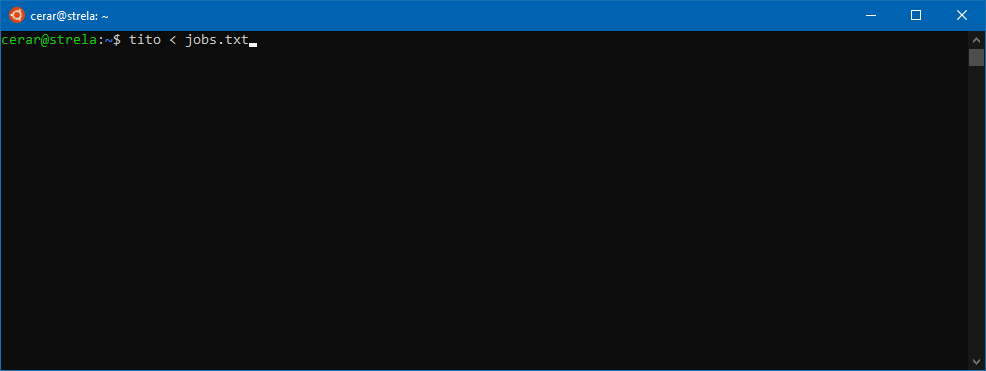

# FKKT __ti:to__ - Shell tool for submitting jobs to cluster network  


[](https://www.gnu.org/software/bash/)
[](https://www.gnu.org/licenses/gpl-3.0.html)  

## What is FKKT __ti:to__?
> "Ti delaj to, ti to, ..."

FKKT __ti:to__ is a shell tool for submitting jobs to cluster networks.  

A job can be a single command or a small script that you want to run. Jobs are submitted as single line of text. For each line of input, FKKT __ti:to__ will submit command to a node on the cluster network with the line as argument. If no command is given, the line of input is executed.  

FKKT __ti:to__ makes sure that all jobs are efficiently submitted to cluster network by using all available node resources before occupying next node. If no free node is currently available, job submission will be halted until a nodes becomes available. In order to minimize impact on the node's performance the availability is checked only every _time_ seconds. Jobs are submitted to cluster nodes using [GNU screen](https://www.gnu.org/software/screen/) interactive shell, allowing user to reattach to given shell and check on the submitted job. Screen shell is automatically closed once the job is finished.  

By default jobs will be submitted to ALL available cluster nodes. In order to limit resource usage, a list of considered nodes can be provided as an optional arguments on the script command line (see examples). All nodes are checked before submission stage and non-responsive nodes are automatically removed. However, an error will occur if none of selected nodes is responsive.       

FKKT __ti:to__ only distributes jobs across nodes - it does NOT check if the submitted jobs work correctly. The latter is the responsibility of the user!  

FKKT __ti:to__ works well with [FKKT kdo]() utility.

## Installing FKKT __ti:to__
This is a script so no installation is needed - Just make sure to make it executable with `chmod +x` and then run with `./tito-dev.sh`.  

However, out of convenience `Makefile` is included. For 'standard' installation, type the following as *root* (or *sudo*):
```bash
make install
```
**NOTE:** Add `DIR=path/to/dir/` to install script to non-standard location.  

## Using FKKT __ti:to__
To run FKKT __ti:to__ simply open a terminal of some sort and type:
```bash
tito [-options] [nodes]
```
The options that may be specified on the command line, are shown below or by executing `tito -h`:
```
-h, --help       -- Print this message.
-v, --verbose    -- Verbose output.
-n, --nthreads   -- Num. of threads per job.
-t, --time       -- Wait time when searching for free node [sec].
-l, --log        -- Write submitted jobs to logfile.
--kill           -- Kill ALL jobs run by user on SELECTED nodes.
```
When submitting jobs using FKKT __ti:to__ general bash syntax applies *i.e.* each line is considered as new command - or in this case, a job to be submitted. If you need to submit "multiple commands under same job" - execute them sequentially, use semicolon - `;` as a separator. Consider the following examples:
```bash
python script1.py
gcc main.c; ./a.out &> log.txt
```
Best practice is to write all jobs to a single file *e.g.* `jobs.txt` then redirect that file to FKKT __ti:to__:
```bash
tito < jobs.txt
cat jobs.txt | tito
```
but that does not mean this is the only way:
```bash
for script in *.py; do echo "python $script"; done | tito
```
By default jobs are submitted to ALL nodes. However, jobs can be submitted to only selected nodes by passing node names as command arguments. Bash variable expansion is also supported:
```bash
tito s2 s3 s4 s5
tito s{2..5}
```
If your submitted job requires multiple threads (via OpenMP or MPI) you can specify that with `-n` flag, followed by num. of threads. FKKT __ti:to__ will submit job only if selected number of threads is available on the node. For example to use 8 threads type:
```bash
tito -n 8
```  
Once job is submitted via a remote shell, you can reattach to that shell in order to check how your job is doing. Upon submission a shell ID is assigned to each job *e.g.* `tito.000`. To reattach to that remote shell type:
```bash
screen -r tito.000
```
Check on your submitted jobs with FKKT `kdo` or with:
```bash
screen -ls
```
Note that when the job is finished the shell is automatically terminated.

FKKT __ti:to__ has a build in kill switch in order to stop ALL currently submitted jobs:
```bash
tito --kill
tito --kill s2 s3
```
In order to stop only selected few nodes pass node names as command arguments. No need to worry about other users as this command only affects jobs submitted by user.

**NOTE:** Since command is submitted via interactive shell all output is redirected to that shell. We suggest using shell I/O redirect to log file (especially useful for catching errors):
```bash
echo 'python script.py &> log.txt' | tito
```

## Notes
When setting up FKKT __ti:to__ do not forget to edit default values in script header.  

<!-- **DISCLAIMER:** Any connection between FKKT __ti:to__ and Yugoslav marshal and politician [Josip Broz - Tito](https://en.wikipedia.org/wiki/Josip_Broz_Tito) is purely coincidental.   -->

## Acknowledgments
Special thanks to:
- Matjaz Simončič - for beta testing and witty comments.  
- Miha Lukšič - for beta testing and name suggestion.  

## License
This program is licensed under the **GNU General Public License v3.0**

Copyright (C) 2019-2020 [Jure Cerar](https://github.com/JureCerar)

This program is free software: you can redistribute it and/or modify it under the terms of the GNU General Public License as published by the Free Software Foundation, either version 3 of the License, or (at your option) any later version.

This program is distributed in the hope that it will be useful, but WITHOUT ANY WARRANTY; without even the implied warranty of MERCHANTABILITY or FITNESS FOR A PARTICULAR PURPOSE. See the GNU General Public License for more details.

You should have received a copy of the GNU General Public License along with this program. If not, see http://www.gnu.org/licenses/.
